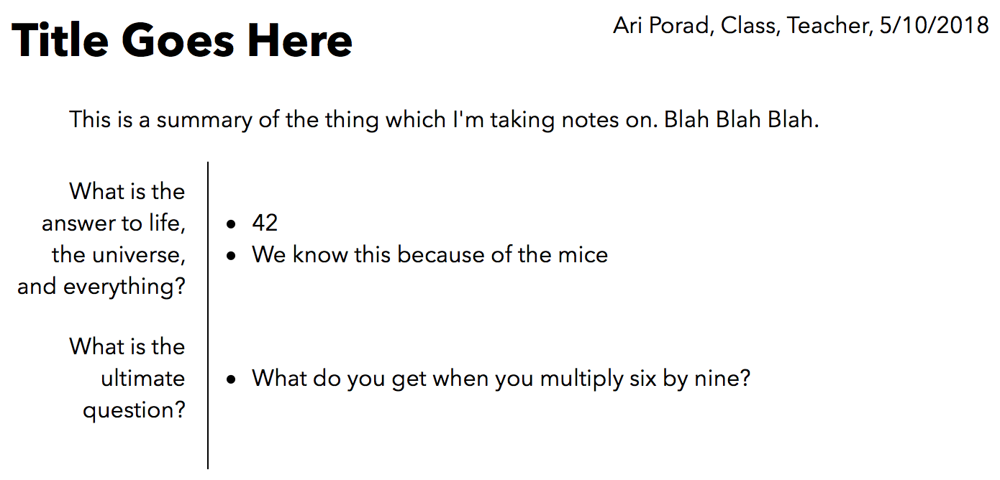

# Schoolkit
## A Simple Toolkit for Managing Schoolwork

I wanted an easy way to manage my schoolwork, so I wrote some bash scripts. These are them. They're very heavily customized to the way that I work, and as such are not guaranteed to work (or keep working) for anyone else. They may break at any time. You have been warned.

## Installation

```bash
git clone https://github.com/ariporad/schoolkit.git ~/.schoolkit
echo "[ -f ~/.schoolkit/index.sh ] && source ~/.schoolkit/index.sh" >> ~/.zshrc
```

## Usage

Schoolkit expects schoolwork to be stored in `~/School/SUBJECT`. Within that folder, files are named as `YYYY-MM-DD Very Interesting Title.ext`, where `ext` is usually `md`.

The primary schoolkit command is (currently) `sn`, which stands for 'school notes'. Usage:

```bash
sn history new World War II # cd to ~/School/history and create/edit "YYYY-MM-DD World War II.md"
sn new Adverbs # the subject can be ommited if you're already in the right dir
sn ls # list notes
sn latest # edit the latest note
sn cornell [note.md] # render the note to HTML Cornell notes (defaults to latest note, see below)
```

## Cornell Notes

I have to/like to take Cornell notes frequently, but I want to take notes in markdown. To solve this problem, schoolkit has a (somewhat hacky) way to render markdown notes to HTML Cornell notes.

Here's the format in markdown:

```markdown
#### Class, Teacher

# Title Goes Here

This is a summary of the thing which I'm taking notes on. Blah Blah Blah.

* What is the answer to life, the universe, and everything?
	* 42
	* We know this because of the mice
* What is the ultimate question?
	* What do you get when you multiply six by nine?
```

Here's the output (your name and the date are added automagically):




## License
[MIT License](https://ariporad.mit-license.org)
